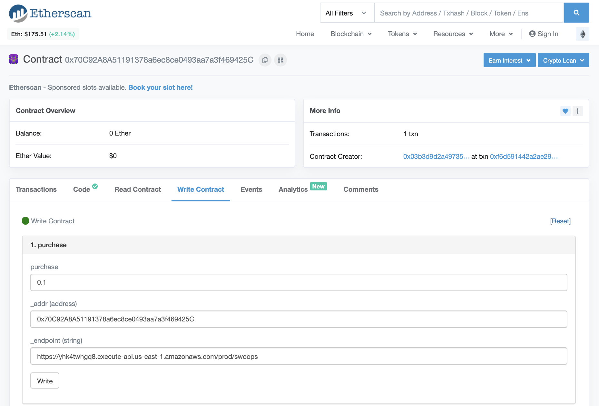

# 🦉 eth-owl
Watch any Ethereum address with 🦉 `eth-owl` to receive real-time callbaks to your webhook(s) for each incoming/outgoing transaction. A permissionless, pseudo-anonymous Ethereum SaaS for developers.

## Quickstart
- setup your REST API endpoint that will receive `POST` requests from 🦉 `eth-owl`
- `purchase` your webhook via the `ethOwl` smart contract https://etherscan.io/address/0x70C92A8A51191378a6ec8ce0493aa7a3f469425C#writeContract



```javascript
{
  purchase: 0.1, // 🦉 `eth-owl` costs 0.1 ETH per webhook, per year
  _addr: '0x70C92A8A51191378a6ec8ce0493aa7a3f469425C', // address to watch
  _endpoint: 'https://yhk4twhgq8.execute-api.us-east-1.amazonaws.com/prod/swoops' // your REST API endpoint that will be pinged (a POST request) for each incoming/outgoing transaction to `_addr`
}
```

#### Docs for your REST API POST endpoint

- PATH
  - `/{your_endpoint_name}`

- Method:
  - POST

- Data params:
  - Required:
    - address=[string] The Ethereum address with an incoming/outgoing transaction that triggered this POST request
    - hash=[string] The transaction hash that triggered this POST request

- Success response:
  - statusCode: `{status_code}`

- Error response:
  - statusCode: `{error_code}` 🦉 `eth-owl` will retry the `POST` request 60 seconds later upon an error

- Sample Call:
  `curl -d '{"address":"0x70C92A8A51191378a6ec8ce0493aa7a3f469425C", "hash":"0xf6d591442a2ae297c383fe74d9e28233844da780f39d93037540232ea75ce6fa"}' -H "Content-Type: application/json" -X POST https://yhk4twhgq8.execute-api.us-east-1.amazonaws.com/prod/swoops`
  
#### 🐶 Dog friendly

In our example [swoops](swoops/), we use the [Serverless Framework](https://serverless.com/) to have a [Lambda](https://aws.amazon.com/lambda/) function run anytime our `endpoint` is pinged by 🦉 `eth-owl`.

`eth-owl` watches the `EthOwl` smart contract `0x70C92A8A51191378a6ec8ce0493aa7a3f469425C` where webhooks are `purchase`d by our users. The `swoops` endpoint is pinged by `eth-owl` for each incoming/outgoing transaction to this address (smart contract). The code it runs adds the `_addr` and `_endpoint` `EthOwl` emits with its `Hoot` event to our database. 🦉 `eth-owl` now watches all incoming/outgoing transactions for `_addr` and hoots to `endpoint`! So [swoops](swoops/) is not only an example for you to follow to quickly get started, it dog-foods 🦉 `eth-owl`, and this is the exact code that runs when you `purchase` a webhook via our `EthOwl` smart contract!

#### Notes
- 🦉 `eth-owl` will ping your webhook within a few blocks of a transaction occuring. Expect a ~1 min delay. If customers ask, latency can be reduced
- 🦉 `eth-owl` is trust minimized. You can run your own node (or [ethql](https://github.com/ConsenSys/ethql), as we do in [swoops](swoops/)) to actually verify the `address` and `hash` in the POST request, and parse the transaction data/events. You should not trust 🦉 `eth-owl` for anything other than its hoots! Especially because POST requests are not signed currently (another feature that can be implemented if customers ask)

